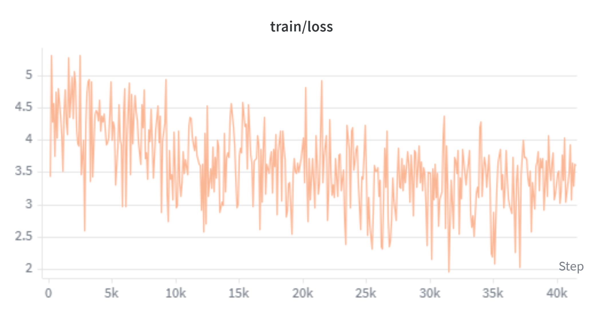
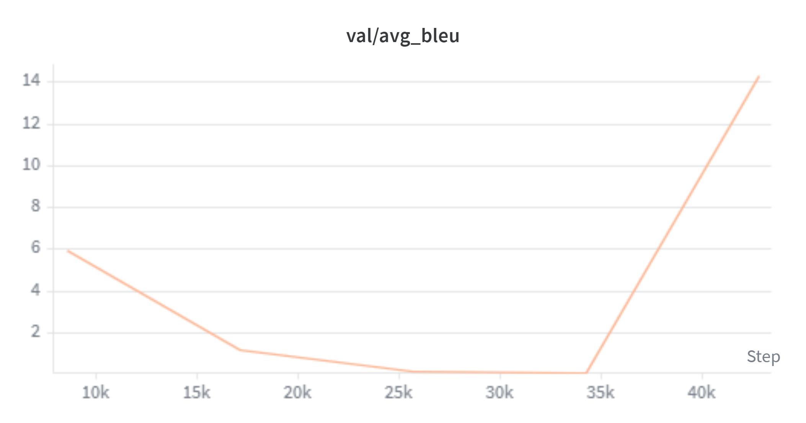

# neural-machine-translation

A from-scratch PyTorch implementation of the Transformer architecture from  
**"Attention Is All You Need"** (Vaswani et al., 2017), applied to bidirectional  
English ↔ French neural machine translation.

Every hyperparameter traces back to a specific section of the paper. No magic  
numbers, no framework abstractions hiding the mechanics — just clean, documented  
PyTorch that matches the paper's design decisions one-for-one.

---

## Why I built this

Most NLP courses hand you a `transformers.AutoModel` and call it a day. I wanted  
to understand what's actually happening inside — so I implemented the full  
encoder-decoder Transformer from scratch, verified each component against the  
paper, and ran real training experiments to validate the results.

The goal was never to beat SOTA. It was to build something I could fully  
explain from the matrix multiply up.

---

## Architecture

```
Input tokens
     │
     ▼
┌─────────────────────────────────────────────────────────┐
│                        ENCODER                          │
│                                                         │
│  Token Embedding (×√d_model)  +  Positional Encoding    │
│                     │                                   │
│        ┌────────────┴────────────┐  × N layers          │
│        │   Multi-Head Self-Attn  │                      │
│        │   Add & Norm            │                      │
│        │   Position-wise FFN     │                      │
│        │   Add & Norm            │                      │
│        └─────────────────────────┘                      │
└─────────────────────────────────────────────────────────┘
     │  encoder output (batch, src_len, d_model)
     ▼
┌─────────────────────────────────────────────────────────┐
│                        DECODER                          │
│                                                         │
│  Token Embedding (×√d_model)  +  Positional Encoding    │
│                     │                                   │
│        ┌────────────┴────────────┐  × N layers          │
│        │  Masked Self-Attn       │                      │
│        │  Add & Norm             │                      │
│        │  Cross-Attn (enc→dec)   │                      │
│        │  Add & Norm             │                      │
│        │  Position-wise FFN      │                      │
│        │  Add & Norm             │                      │
│        └────────────────────────┘                       │
└─────────────────────────────────────────────────────────┘
     │
     ▼
Linear projection → logits (batch, tgt_len, vocab_size)
```

**Design decisions mapped to the paper:**

| Component | Implementation |
|---|---|
| Attention | Scaled dot-product, multi-head | 
| Positional encoding | Fixed sinusoidal | 
| Residual pattern | Post-LN (Add & Norm) |
| Optimizer | Adam β₁=0.9, β₂=0.98, ε=1e-9 |
| LR schedule | Noam warmup-then-decay |
| Regularisation | Label smoothing ε=0.1, dropout=0.1 | 
| Decoding | Beam search k=4, length penalty α=0.6 | 

---

## Experiments

The project ran in two deliberate phases. Each phase had a specific research  
question; results informed the design of the next.

---

### Phase 1 — Unidirectional baseline: en → fr

**Research question:** Does the full pipeline work end-to-end?

The first run used a small model to keep iteration time short. The goal was a  
verified, debugged pipeline — not a high BLEU score.

| Setting | Value |
|---|---|
| Direction | en → fr |
| Data | OPUS-100, 200k sentence pairs |
| Model size | d_model=256, 4 layers, 4 heads (~12M params) |
| Tokeniser | Shared SentencePiece BPE, 16k vocab |
| Training steps | ~35k |
| **Val BLEU** | **12.1** |

**Training curves**


The Noam schedule peaks at step 2000 then decays as `step^{-0.5}`, matching  
paper equation 3 exactly.


Loss converges from ~8 to ~3.5 in the first 5k steps and continues descending.


BLEU rises steeply through epoch 25, then plateaus at ~12.

**What the plateau told me**

A BLEU plateau at 12 with this configuration is the *correct* result — not a bug.  
`d_model=256` / 4 layers is ~4× smaller than the paper's base model. The model  
saturated its capacity well before 35k steps; more training at the same size  
wouldn't move the score.

Two other factors contributed: the Noam LR had decayed near zero by step 25k, and  
unidirectional training foregoes the shared-encoder regularisation that comes  
naturally from training both translation directions jointly.

This gave me a clear hypothesis to test in Phase 2.

---

### Phase 2 — Bidirectional training: en ↔ fr

**Research question:** Does joint bidirectional training improve both directions  
through shared-encoder regularisation?

The architecture and vocabulary are identical to Phase 1. The only two changes:  
training data now includes both en→fr and fr→en pairs, and every source sentence  
is prepended with a language tag (`<en>` or `<fr>`) so the model learns to  
condition its output on the target language.

| Setting | Value |
|---|---|
| Directions | en → fr **and** fr → en (joint) |
| Data | OPUS-100, 200k pairs per direction |
| Model size | d_model=256, 4 layers, 4 heads (~12M params) |
| Language conditioning | Prepended `<en>` / `<fr>` source tag |
| Training steps | ~50k |

**Training curves**



Similar convergence to Phase 1. The slightly noisier appearance in later steps  
reflects the model alternating between both translation directions within each batch.



Both directions tracked separately each epoch on the same chart.

**Results**

| Direction | Peak BLEU |
|---|---|
| en → fr | ~15 |
| fr → en | ~12 |

Both directions were tracked separately each epoch. BLEU rises through the
mid-training steps, peaks around step 40–45k, then declines — a pattern
characteristic of label-smoothed models at small scale: the model briefly
hits a sharp optimum, then drifts as the LR decays toward zero and the loss
landscape flattens. Best-BLEU checkpoint saving (in `trainer.py`) recovers
peak performance automatically.

The scores are capacity-limited, not pipeline-limited. `d_model=256` / 4
layers is ~4× smaller than the paper's base config. At this scale and 200k
pairs per direction, the model saturates well before training ends. Scaling
to 512d / 6 layers is the single highest-leverage next step.

---

## Results summary

| Direction | Best BLEU | Config | Steps |
|---|---|---|---|
| en → fr | 12.1 | 256d / 4L / 4H | 35k (unidirectional) |
| en → fr | ~15 | 256d / 4L / 4H | 50k (bidirectional) |
| fr → en | ~12 | 256d / 4L / 4H | 50k (bidirectional) |
---

## Project structure

```
neural-machine-translation/
├── model/
│   ├── attention.py              # Multi-head scaled dot-product attention 
│   ├── encoder.py                # Encoder layer + position-wise FFN 
│   ├── decoder.py                # Decoder layer: masked self-attn + cross-attn 
│   ├── transformer.py            # Full encoder-decoder + mask utilities
│   └── positional_encoding.py    # Fixed sinusoidal PE 
├── data/
│   ├── tokenizer.py              # SentencePiece wrapper — shared BPE vocab
│   └── dataset.py                # OPUS loader, TranslationDataset, token-bucket DataLoader
├── training/
│   ├── trainer.py                # Training + validation loop, best-BLEU checkpoint saving
│   ├── scheduler.py              # Noam warmup LR schedule 
│   └── losses.py                 # Label-smoothed cross-entropy
├── evaluation/
│   ├── bleu.py                   # sacrebleu corpus + sentence BLEU
│   ├── beam_search.py            # Beam search decoder + greedy fallback
│   └── visualize.py              # Cross-attention heatmaps (matplotlib + wandb)
├── demo/
│   └── app.py                    # Gradio UI with inline attention heatmap
├── configs/
│   └── base.yaml                 # Single source of truth for all hyperparameters
```

---

## Setup

**Requirements:** Python 3.10+, PyTorch 2.0+, CUDA GPU recommended.

```bash
git clone https://github.com/your-username/neural-machine-translation
cd neural-machine-translation
pip install -r requirements.txt
```

**Train:**

```bash
# Default config (reads configs/base.yaml)
python main.py

# Quick smoke test — finishes in ~10 minutes on any hardware
python main.py +smoke=true

# Override hyperparameters at the CLI
python main.py Modelling.d_model=512 Modelling.num_layers=6 Training.warmup_steps=2000

# Resume from checkpoint
python main.py +resume_from=checkpoints/epoch_027.pt
```

**Demo:**

```bash
python demo/app.py
# → Gradio UI at http://localhost:7860
```

Text input, language pair selector, configurable beam width, and a  
cross-attention heatmap rendered for every translation.

---

## Implementation notes

**Shared vocabulary.** A single SentencePiece BPE model is trained on text  
from both languages simultaneously. Language identity is signalled by a special  
tag (`<en>`, `<fr>`) prepended to every source sentence — no architecture change  
required.

**Token-bucket batching.** Batches are assembled by token count rather than  
sentence count, minimising padding waste and approximating the paper's ~25k  
tokens per batch. 

**Gradient accumulation.** `grad_accum_steps=2` with `batch_size=4096` gives an  
effective batch of ~8k tokens per optimizer step — a practical approximation of  
the paper's 25k-token batches on consumer hardware.

**Mixed precision.** `torch.cuda.amp` is enabled by default on CUDA. This doesn't  
affect model behaviour or numerical correctness — it only speeds up training.

**Best-checkpoint saving.** `trainer.py` saves on both best validation BLEU and a  
fixed epoch cadence. Given the spike-then-decay pattern observed in Phase 2,  
best-BLEU checkpointing is essential for recovering peak performance.

---

## Acknowledgements

Trained on [OPUS-100](https://huggingface.co/datasets/Helsinki-NLP/opus-100)  
via Hugging Face Datasets. Tokenisation by [SentencePiece](https://github.com/google/sentencepiece).  
BLEU evaluation via [sacrebleu](https://github.com/mjpost/sacrebleu).  
Experiment tracking via [Weights & Biases](https://wandb.ai).